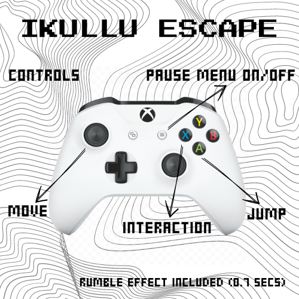
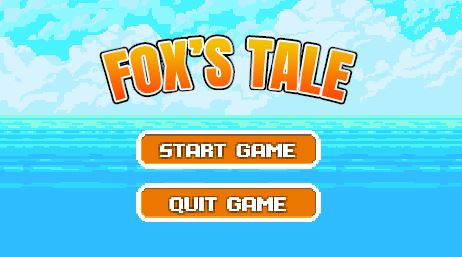
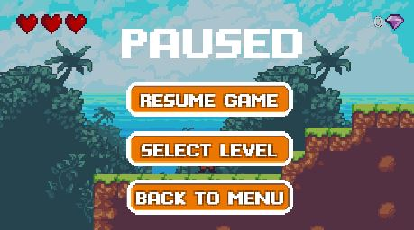
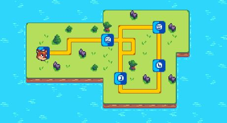
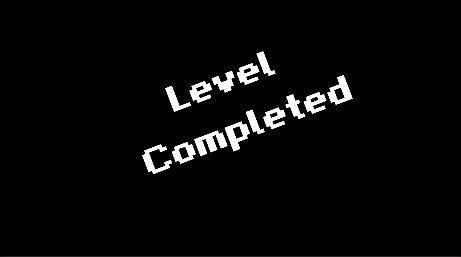
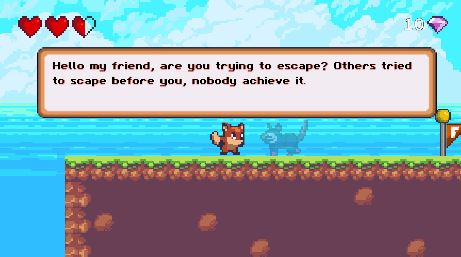
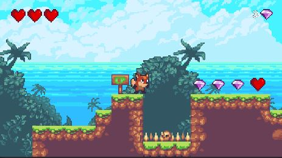

# IKULLU ESCAPE GAME DOCUMENTATION

This game has been developed using the Unity Game Engine. It is a 2D platformer like game and it has been developed using this tutorial:  
https://www.youtube.com/watch?v=JMT-tgtTKK8

The game has some features that make it more than functional and it makes it enjoyable to the eyes of the player. The game has been developed using the popular Sunny Island presets.

Inside of the directory called Development Planning you can find a small document of the development process, you will find the work done each day and note about the workflow.

[Development Planning](https://github.com/Multimedia-2023-24/game-unity-Julen-H/blob/main/Development%20Planning/README.md)

These are the feature that offers the game:  

## Animations

All the characters, enemies and their movements are animated. They have been created using the animator and creating them to make smooth transitions and movements. The animations are a sequence of the presets itself, they are placed maintaining a time interval to make the movement animation. Each character has its own animations, but the main character has five; idle, run, jump, invincibility and hurt.

## Character mechanics

The main character has some mechanics to keep going in the level. The main mechanic is the jump mechanic. Thanks to that mechanic the player can pass obstacles, kill enemies and collect pickups. The game implements a double jump mechanic to make the game experience more dynamic. The player can only jump when the ground is touched and it will be able to jump a second time.

## Pickups

Pickups are another level mechanic that are implemented in the game. The player is going to be able to pick up gems and hearts. The gems themselves, once they are picked, don't give a chance to do nothing with them but in a future if the game is going to be finished it can implement a mechanic to exchange them with objects or another kind of items. The hearts by the other hand give a life to the player. They are located in strategic places, usually after a hard platformer spot or after fighting enemies.

## Graphical User Interface (GUI)

The game implements an interface to show the life that the player has at the moment and the gems that has picked. The interface is modified in real time, if the player is picking gems the gem count is going to be incremented in real time, the same happens with the hearts. If the player picks one the life of the player will increase by one.

## Checkpoint System

The checkpoint is a safe area where the player is going to be respawned if he dies. In this game the checkpoints are controlled by a script and they have implemented a logic to be activated the moment the player hits its collider. There are various checkpoints in the level, in the script it develops a logic to only activate the checkpoint that is further to the player position. 

If the player hits a checkpoint and then hits another it will remain only the second one, this is made to help the player to advance in the level. Is important to say that, if the player is respawned in a checkpoint, will do it with all their lives and the enemies and collectibles won’t respawn like the player did. The amount of gems will remain also.

## Music and Sound Effects

The music and sound effects are another feature of the game. The main theme will be playing in a loop while the player is in a level. The sound effects are inserted depending on the action that the player is doing, for example jumping. To control this multimedia feature the game has implemented a sound controller where we can adjust the volume of the sound output.

## Enemies

The game has implemented two types of enemies. The first type of enemy is a land type enemy, in this exact case is a frog. This enemy is going to be moving on the ground, the frog will be jumping and is going to do a linear movement that is limited to two points. The enemy is going to be able to damage the player and is going to be also killed by the player. Each time that the player gets hit by the enemies is going to lose one life.

The second type of enemy is a flying type enemy. To be more specific is going to be an eagle. The movement has been created using the same logic as the frog, the route is limited by two points so the enemy will be moving in that direction. The damage mechanic is also the same as the frog, but this time the eagle is going to start chasing the player. The player can escape from him or kill it. The enemies have two colliders, one to be killed and another to die, depending where is going to be hit the enemy will do one thing or another.

## Invincibility Mechanic

The invincibility is another mechanic that has been created to help the player to advance in the levels. The invincibility is a mechanic that allows the player to have a small time lapse between hits to surpass obstacles or enemies without receiving another hit. The main idea is to create a game that is accessible to all players so this helps in that sense. The invincibility is visible adjusting the gamma channel of the sprite of the player losing its coloration.

## Moving Platform

The game has implemented a moving platform to finish the second level. It has been created using the enemies logic to move between points. The moving platform is located at the end of the second level to help the player to reach the NPC and finish the game. We can say that it is located there as a highlight. 

## Main Menu

The main menu is a key functionality and feature of the game. This menu leads the player to start the game and exit. And also works as a bridge once the last level is finished. The main menu has a simple and an elegant pixel art design, it shows the title and two buttons; one for starting the game and other for quitting the game. The menu itself is a canvas and has its own scene, the buttons can change the color when the cursor passes above it.

## Pause Menu

The pause menu is another key functionality and feature of the game. Is a bit different compared to the main menu. It has small changes, the background has a dark tonality and has three buttons. The buttons are for resuming the game, for going to the level select menu and to return to the main menu. 

These buttons have the same design as the ones implemented in the main menu but the actions are different. The player can enter the play menu by pressing the escape button and pressing the menu button in the XBOX controller (also identified as the 7th button). The game pauses its state, meaning that the player can't move or do anything, it can only run the buttons of the pause menu. 

If the player hits the resume game the state will start again and he will continue playing (is also possible to press the buttons again, this works as open and close action), if the player presses the level select button the level will be closed and it will redirect to the level menu. And finally if he presses the main menu button it will exit to the main menu, there you can close or start the game again.

## Level Select Menu

The level select menu is a functionality to change scenes or levels in the game. It can be entered immediately using the pause menu. This menu is a mini map of the world that has paths to the levels. The map has been generated using different layers of tilemaps and using a controller.   

This controller knows if the current point of the player is a level or not. If the current point is a level and has been reached it can be entered. This works by adding keys to the PlayerPrefs. In the first run the second level can’t be reached if the first one is not completed. When the player completes a level the controller adds a key to the PlayerPrefs and when the level select menu is opened it can be reached. 

The points between levels have been made using map points that are in essence empty game objects with a certain position. Through the controller, for each position, only certain movements are available. In this way we can limit the player movement to the road and be able to reach the levels.

## New Features

The game adds three main new features; the addition of an interactive NPC, the adjustment of inputs to play with a XBOX controller and the addition of a tutorial level.

## Interactive NPC  

An npc is a non playable character that acts like a guide through the world. It will give you clues and will appear in key points of the map. The npc is a ghost, a character that time ago tried to escape from Ikullu but he didn’t reach the final. Tormented by that his spirit remained in the path to help lost players to reach freedom.  

This npc has different dialogues each time it appears. It is possible to read his interaction, for that purpose the game has implemented an interaction input (to the keyboard and to the controller). Pressing the button we can read between his dialogues. In addition, the game also has a signal with the same logic but it has only a single interaction with the player.

The npc has been developed using a sprite and a npc dialogue that has been made using a ui canvas. The sprite is just the npc itself and has a collider. When the player hits the collider the interaction will start and pressing the interaction button we will be able to read between the dialogues. The dialogue itself is a box added in a canvas, to change between lines it has implemented a script.

## XBOX Controller

The games that are developed using the Unity game engine have compatibility with different devices. Usually are built for pc giving the chance to control them using a controller. By default the game has been developed to control it using the keyboard but over the years Unity has been implementing new support for the input systems. 

Nowadays some basic input as the horizontal input are dual imputed but in this case we have developed the chance to extend that compatibility.

After a research of how the different buttons of the controllers are setted in the engines, we have adapted the inputs in the input manager and we have added them to our game. The buttons for jumping, interaction and menu access have been configured and added to the game. It has also added the rumble action for the controller. 

When the player gets hit the rumble will happen in the controller giving a plus to the game experience. The rumble effect or action has been implemented along the invincibility dynamic, we have matched both duration to fit them in a smoother way.

To create the rumble effect of the controller we have developed a coroutine that is going to be called each time the player gets hit in the game by an obstacle or an enemy. This coroutine is going to work in a certain amount of time that, as we said before, is the same time as the invincibility length. 

This delay or duration of the rumble is sent to the coroutine and in that period the left and right motors of the controller will rumble, when the delay ends the motor speeds will be set again in 0.

Before we created the rumble coroutine we setted some features in the project setting. Years ago Unity setted as a separate package the Input System. This system is new and is controlled in a different way than the old version. 

In the old version we could control and do action assigning them to buttons. In the new system you need to set action maps depending on your needs setting each movement to one action. For that you should create an action and a binding to specify how the action will be connected to the input.

To do the rumble we have used the Gamepad class that is inside this new input system, but all the movement and interaction with the outer world was configured already with the old input system. Unity gives you the option to allow the coexistence of both versions of input systems but you need to specify in the player setting. 

When you enter the player setting you need to go to the section called Other Setting and there find Active Input Handling. Once you find it you have to give the Both value to allow the coexistence of both input systems. If you don't do this step the old input system can be ignored and can cause problems in the development process.

## Controls

## User Guide

When the game starts running the player will be sent to the main menu. This menu is the hub area of the game, from this menu you can start playing and quit the game. If you press the quit game button the game will be close, but if you click on the start game button the player will start playing the first level of the game.

At this point the player can play the game in a normal way, we can advance in the level but if he wants to pause the game he will need to press the escape button or the menu button in his controller. Entering in this menu pauses the game state, the player will not be able to move or misclick anything that can affect his game. In this menu it present three options:

**Resuming the game** -> The game will start to run at the same moment and state that it was at the time that the player clicked the pause menu. You can resume it by pressing the button directly or pressing again the escape (keyboard) or menu button on the controller.

**Level select** -> The level select menu is a minimap that can be navigated and can change between levels. Entering the level select will lose the progression of the level that was playing the player so you must think twice before you enter the level select. In the first run of the game the player will not be able to enter the second level until the first one is completed. The states of the levels are stored in the Player Prefs giving a key to them.

**Main menu** -> Pressing this button will redirect the player to the main menu. The progression of the level will be lost in the same way that will be lost if you enter the level select menu. Once the player is in the main menu will be able to restart the game or quit it.

In general there are no more features to take into account. The levels will end once you get to the final and you reach the flag. When you reach the flag a mini cinematic will be shown and will be loaded the next scene. 

The interactions also happen in an intuitive way, once you find the guide npc the player will be able to interact with him. For that purpose the interaction button was implemented, the npc has an exact dialogue for each time it appears, so if you get close the npc will start talking, pressing the interaction button will pass to the next dialogue line.

Finally, it is important to mark that the checkpoints have a small explanation that will help the user. For each level there are different checkpoints located in strategic places. The checkpoint will be activated if you get close enough to them, it is easy to see if it is activated, the signal will turn green if it is activated. If you reach nother checkpoint later the one that has been activated last will remain so if the player dies will be respawned in the checkpoint. The enemies won't respawn and the player will have again all the health points. 

## Execution Video on Youtube

Click the image to see the video:

